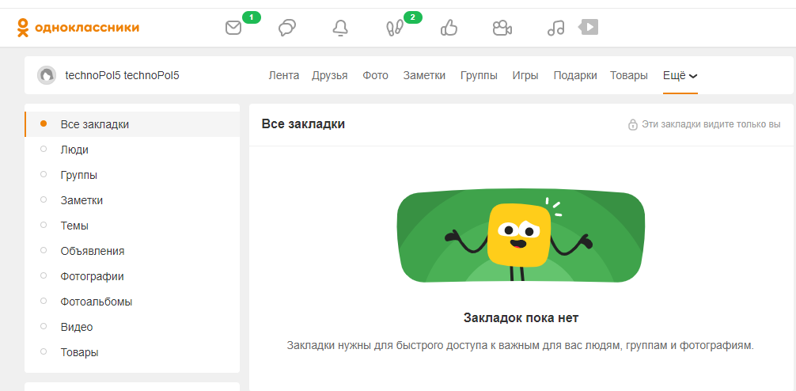

# Разработка автоматизированных тестов с использованием библиотеки Atlas

___

### Atlas

Java-фреймворк нового поколения для разработки UI-автотестов с реализацией паттерна Page Object через интерфейсы. Данный
подход предоставляет возможность множественного наследования при построении дерева элементов, что в итоге обеспечивает
лаконичный код ваших автотестов.
Основным нововведением фреймворка является использование интерфейсов вместо стандартных классов.
___
В проекте производится тестирование работы раздела "Закладки" сайта Одноклассники https://ok.ru/

